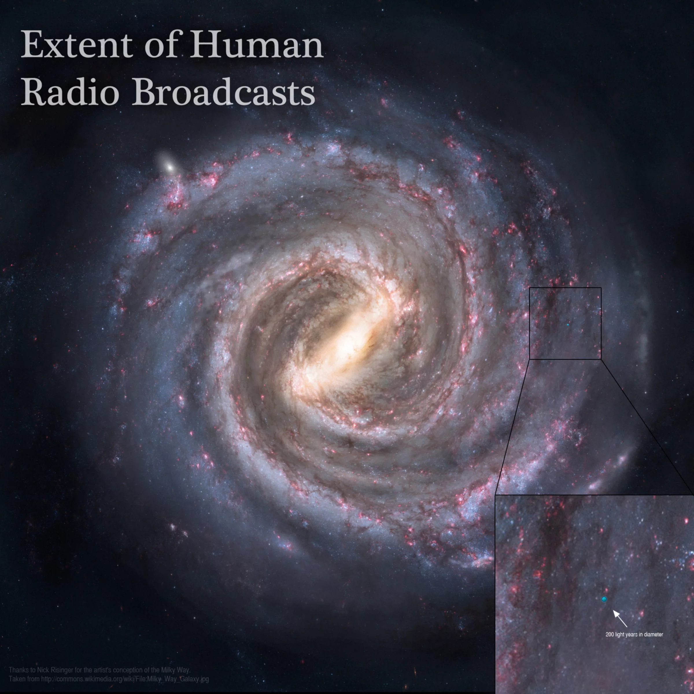

why the [Fermi Paradox](wiki/Science/cosmology/Fermi%20Paradox.md) isn't ...

# Extent of human radio broadcasts
Humans have been broadcasting radio waves into deep space for about a hundred years now, since the days of Marconi. That, of course, means there is an ever-expanding bubble announcing Humanity's presence to anyone listening in the Milky Way. This bubble is astronomically large (literally), and currently spans approximately 200 light years. But how big is this, really, compared to the size of the Galaxy in which we live (which is, itself, just one of countless billions of galaxies in the observable universe)? To answer that question, Adam Grossman put together this diagram. It's not the black square; it's the little blue dot at the center of that zoomed-in square. -- _Adam Grossman / Nick Risinger_

